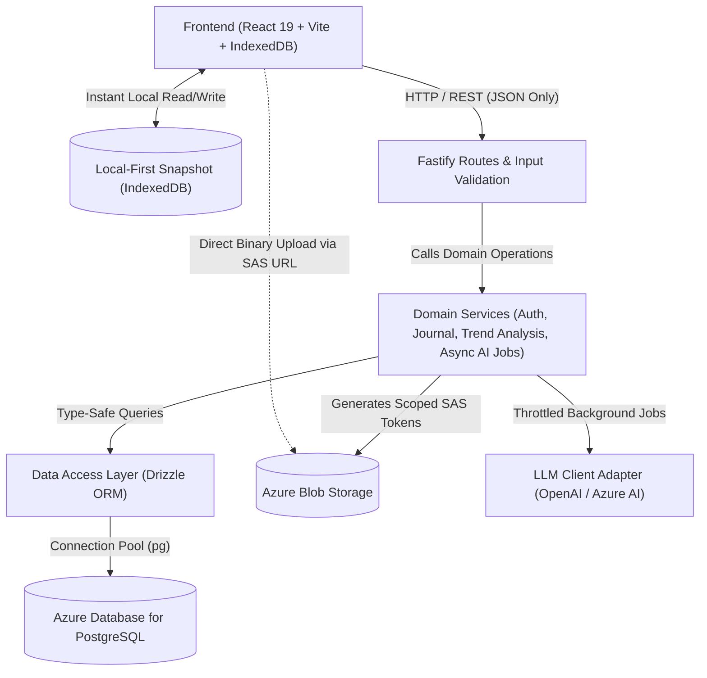

# Architecture Spine — Daily Mind & Mood Journal

## Design Paradigm

The application follows a **Layered Modular Architecture** with strict inward-pointing dependencies, augmented with **Direct-to-Storage Media Ingestion** and **Local-First Client Snapshots** to guarantee zero data loss and resilience under high concurrent load.

- **Presentation Layer (Web / Fastify):** HTTP route handlers, schema validation, and SAS token issuance. Decoupled from database drivers and binary streaming.
- **Domain Service Layer:** Pure business logic, deterministic calculations (e.g. mood-activity correlation), and asynchronous job queue orchestration. Fully testable in isolation with zero database or network dependencies.
- **Data Access Layer (Drizzle ORM):** Type-safe queries and schema definitions compiled to raw PostgreSQL.
- **Client Local-First Tier (IndexedDB):** Browser-side persistent replica storing all journal entries locally. Acts as authoritative local snapshot guarding against catastrophic cloud outages.
- **Infrastructure / Cloud Adapters:** Azure Blob Storage adapter (SAS generation & blob lifecycle) and external LLM client adapter with concurrency throttling.



## Invariants & Rules

### AD-1 — Strict Layered Dependency Direction [ADOPTED]
- **Binds:** `all backend components`
- **Prevents:** Business logic leaking into HTTP route controllers or database queries written directly in presentation handlers.
- **Rule:** Fastify route handlers may only parse/validate requests and delegate directly to Domain Services. Route handlers must never import Drizzle tables or query builders directly.

### AD-2 — Database & Resource Safety Invariants (3 AM Production Guardrails) [ADOPTED]
- **Binds:** `data access, API list endpoints, PostgreSQL configuration`
- **Prevents:** Unbounded table scans, missing indexes, connection exhaustion, and CPU spikes pinning the database to 100%.
- **Rule:**
  1. Every query returning a collection must enforce pagination with `MAX_LIMIT = 50` (default 20).
  2. Every foreign key (`user_id`) and timestamp column used for filtering (`entry_date`, `created_at`) must possess an explicit B-tree index in the Drizzle schema.
  3. PostgreSQL connection pool must enforce `statement_timeout = 3000ms`, `connectionTimeoutMillis = 5000ms`, `idleTimeoutMillis = 10000ms`, and `max_connections = 20` to prevent query starvation.

### AD-3 — Two-Phase Deterministic AI Architecture & Async Queue [ADOPTED]
- **Binds:** `ai-companion, trend analysis, server concurrency`
- **Prevents:** Non-deterministic hallucinations, slow/flaky unit tests, and connection pool exhaustion when high volumes of AI review requests arrive.
- **Rule:** 
  1. Trend analysis logic (e.g. calculating delta between walk days and baseline mood) must be executed deterministically in pure TypeScript domain functions with 100% test coverage.
  2. Multi-entry AI review requests are handled asynchronously: endpoint returns `202 Accepted` with a `jobId` rather than keeping HTTP connections hanging. Jobs are processed against an upstream rate-limiter matching the LLM provider's token quota.
  3. Identical date ranges return cached reflection summaries to prevent redundant LLM invocations.

### AD-4 — Human-Approved Azure Provisioning [ADOPTED]
- **Binds:** `cloud infrastructure, deployment`
- **Prevents:** Opaque background cloud executions, unmonitored costs, and lack of operator control.
- **Rule:** All cloud resources must be scripted idempotently in `infra/setup-azure.ps1` using explicit `az cli` commands with inline commentary explaining the purpose and cost tier. Scripts are executed exclusively by the user after manual review.

### AD-5 — Ponytail Minimalism & TDD Verification Gate [ADOPTED]
- **Binds:** `all development workflows`
- **Prevents:** Over-engineering, speculative abstractions, bloated npm dependency trees, and unverified AI code.
- **Rule:** 
  1. The Ponytail ladder is enforced: stdlib and native platform features (e.g. `<input type="date">`, browser `OffscreenCanvas`, native `crypto.randomUUID()`) take priority over external npm packages.
  2. No production code may be authored without a preceding failing test (Red-Green-Refactor).
  3. Every pull request or commit diff must remain under 50 lines.

### AD-6 — Direct-to-Storage Upload & Client-Side Image Preprocessing [ADOPTED]
- **Binds:** `media-storage, client-upload`
- **Prevents:** Server network interface saturation, Node.js event-loop freeze from image resizing, and HEIC format rejections from mobile devices.
- **Rule:** 
  1. Binary image data never streams through the Node.js Fastify process under normal load. The backend issues a short-lived (15-minute), scoped Azure Blob SAS URL (`POST /api/journal/entries/:date/photo-upload-url`).
  2. The frontend compresses and resizes photos client-side (converting raw camera shots, including iOS HEIC/HEIF, to WebP at max 2048px, ~400KB) via HTML5 Canvas / OffscreenCanvas before uploading directly to Azure Blob Storage.

### AD-7 — Local-First Client Snapshot & Zero Data Loss Guarantee [ADOPTED]
- **Binds:** `client-state, data-sync, disaster-recovery`
- **Prevents:** Catastrophic user data loss if the Azure database becomes permanently unavailable or corrupted.
- **Rule:** 
  1. The frontend stores all journal entries in browser **IndexedDB** as a persistent local snapshot before or in parallel with cloud synchronization.
  2. The application provides a one-click "Download Complete Journal Snapshot" button generating a single JSON/ZIP file containing all text, metadata, and cached images.
  3. In a disaster-recovery scenario where the cloud database is empty or lost, the frontend local snapshot can re-seed the backend via a batch import endpoint.

## Consistency Conventions

| Concern | Convention |
| --- | --- |
| **Naming (Files)** | `kebab-case.ts` for files; `kebab-case.test.ts` for tests. |
| **Naming (Code)** | `camelCase` for functions/variables; `PascalCase` for types/classes; `SCREAMING_SNAKE_CASE` for constants. |
| **Data & Dates** | All dates stored and transferred in UTC ISO-8601 strings (`YYYY-MM-DD` for entries, full ISO for timestamps). |
| **Identifiers** | UUID v4 generated via native crypto (`crypto.randomUUID()`). |
| **Error Envelopes** | Consistent JSON response: `{ "error": { "code": "STRING_CODE", "message": "Human message" } }`. |
| **Authentication** | Bearer token in `Authorization` header containing signed stateless JWT. |

## Stack (Pinned Versions)

| Name | Version | Role |
| --- | --- | --- |
| **Node.js** | `22.x LTS` | Backend runtime |
| **TypeScript** | `5.7.x` | Static type checking |
| **Fastify** | `5.x` | High-performance HTTP server & schema validation |
| **Drizzle ORM** | `0.38.x` | Type-safe SQL query layer |
| **Drizzle Kit** | `0.30.x` | SQL migration generator and runner |
| **pg (node-postgres)** | `8.13.x` | PostgreSQL driver & connection pool |
| **@azure/storage-blob** | `12.x` | Official Azure Blob Storage SDK (SAS generation & lifecycle) |
| **React** | `19.x` | Client UI library |
| **Vite** | `6.x` | Frontend build tool and dev server |
| **Tailwind CSS** | `4.x` | Utility-first styling |
| **Vitest** | `3.x` | Fast unit & integration test runner |

## Structural Seed

```text
booking-service/
  infra/
    setup-azure.ps1        # Idempotent Azure CLI provisioning script
  server/
    src/
      db/
        schema.ts          # Drizzle table schemas and indexes
        connection.ts      # Postgres pool & Drizzle client
      modules/
        auth/              # Registration, login, password hashing, JWT
        journal/           # CRUD for daily entries & SAS upload token issuance
        analytics/         # Deterministic trend calculations
        ai/                # Asynchronous LLM job queue and prompt integration
      app.ts               # Fastify instance & plugin registration
      server.ts            # Entrypoint
    tests/                 # Vitest test suites (auth, journal, analytics)
    drizzle/               # Generated SQL migrations
    drizzle.config.ts      # Drizzle Kit configuration
    package.json
    tsconfig.json
  client/
    src/
      components/          # UI components (EntryEditor, ChatDrawer, ExportModal)
      db/                  # Local-first IndexedDB storage & snapshot manager
      utils/               # Image preprocessor (Canvas resize & WebP conversion)
      App.tsx
      main.tsx
    package.json
    vite.config.ts
```

## Deferred

- **Full RAG / Vector Embeddings:** Deferred until journal history exceeds several hundred entries; standard SQL queries + filtered prompt injection suffice for single-user scale.
- **WebSocket Streaming for Chat:** Deferred; HTTP polling or Server-Sent Events (SSE) for async AI jobs keeps architecture simple.
- **Multi-Cloud Cross-Cloud Replication:** Deferred per user preference; local-first client snapshotting provides disaster recovery guarantee without multi-cloud infrastructure complexity.
